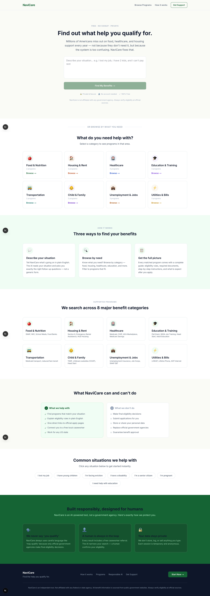
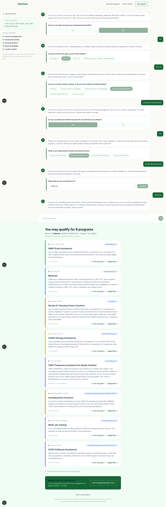
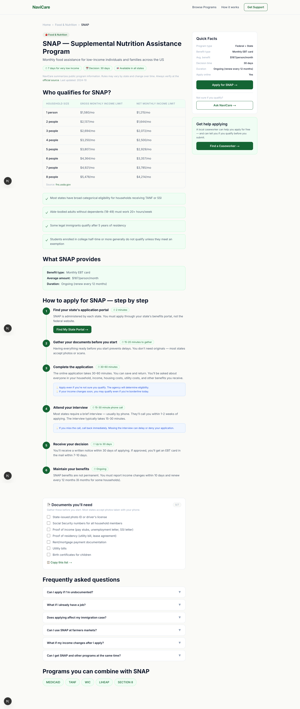

<p align="center">
  <strong style="font-size: 2em; color: #166534;">🧭 NaviCare</strong>
</p>

<h3 align="center">
  AI-Powered US Government Benefits Navigator
</h3>

<p align="center">
  <em>Find out what help you qualify for — in under 2 minutes.</em>
</p>

<p align="center">
  
  
  
  
  
  
  
  
</p>

---

## 📖 Table of Contents

- [Overview](#-overview)
- [The Problem](#-the-problem)
- [How NaviCare Solves It](#-how-navicare-solves-it)
- [Screenshots](#-screenshots)
- [Features](#-features)
- [Tech Stack](#-tech-stack)
- [Architecture](#-architecture)
- [Getting Started](#-getting-started)
- [Project Structure](#-project-structure)
- [Pages & Routes](#-pages--routes)
- [API Endpoints](#-api-endpoints)
- [Programs Database](#-programs-database)
- [Components](#-components)
- [Design System](#-design-system)
- [AI System Prompts](#-ai-system-prompts)
- [Responsible AI Principles](#-responsible-ai-principles)
- [Environment Variables](#-environment-variables)
- [Scripts](#-scripts)
- [Contributing](#-contributing)
- [Disclaimer](#-disclaimer)
- [License](#-license)

---

## 🌍 Overview

**NaviCare** is an AI-powered web application that helps Americans discover government benefit programs they may be eligible for. Instead of navigating dozens of confusing government websites, users can simply describe their situation in plain English — and NaviCare's conversational AI will ask targeted follow-up questions, assess eligibility across **22+ federal and state programs**, and deliver personalized results with direct application links, step-by-step guides, and required document checklists.

NaviCare is:
- 🆓 **100% Free** — No cost, no premium tiers
- 🔐 **Private** — No data is stored, logged, or sold
- 📝 **No Signup Required** — Completely anonymous
- 🤖 **AI-Powered** — Uses Google Gemini 2.5 Flash for intelligent conversation
- 🇺🇸 **Works for All 50 US States** + Washington D.C.

---

## 🚨 The Problem

Every year, **millions of Americans miss out on billions of dollars** in government benefits — not because they don't need help, but because:

| Pain Point | Impact |
|---|---|
| **Too many programs** | 22+ major federal/state benefit programs spread across dozens of agencies |
| **Confusing eligibility rules** | Income thresholds vary by household size, state, and program — with exceptions and edge cases |
| **Fragmented information** | Each program has its own website, application portal, and process |
| **Intimidating process** | Long forms, required documents, interviews, and jargon discourage applicants |
| **No single starting point** | People don't know what they qualify for, so they don't even try |

---

## ✅ How NaviCare Solves It

NaviCare provides **three ways** for users to discover benefits:

### 1. 💬 AI Conversation (Primary Flow)
Users describe their situation in plain English. NaviCare's AI conducts a warm, targeted conversation — asking **one question at a time** about relevant topics (income, family, housing, health, location). After 4–8 exchanges, it generates personalized program recommendations with confidence levels and reasoning.

### 2. 🔍 Browse by Category
Users can directly browse programs across 8 major categories: Food & Nutrition, Housing & Rent, Healthcare, Education & Training, Transportation, Child & Family, Unemployment & Jobs, and Utilities & Bills.

### 3. 📋 Program Detail Pages
Every program has a comprehensive detail page with eligibility tables, step-by-step application guides, interactive document checklists, FAQs, and links to compatible programs.

---

## 📸 Screenshots

### Landing Page


### AI Chat Interface


### Program Detail Page


---

## ✨ Features

### Core Features
| Feature | Description |
|---|---|
| **Conversational AI Assessment** | Natural language conversation that adapts questions based on user's specific situation |
| **22+ Program Database** | Comprehensive data on SNAP, Medicaid, CHIP, Section 8, TANF, WIC, LIHEAP, and many more |
| **Personalized Matching** | AI-driven eligibility analysis with confidence levels (likely / possible / borderline) |
| **Program Detail Pages** | In-depth guides for every program with eligibility tables, application steps, and FAQs |
| **Interactive Document Checklist** | Checkable document lists with progress tracking and copy-to-clipboard functionality |
| **Category Browsing** | Filter and explore programs across 8 benefit categories |
| **Caseworker Referral** | Every result includes a link to find a free local caseworker via FindHelp.org |
| **Quick Topic Pills** | Pre-built situations ("I lost my job", "I'm pregnant", etc.) for instant start |

### UX & Design Features
| Feature | Description |
|---|---|
| **Custom Cursor** | Desktop-only custom cursor with interactive states (hover, card, click) |
| **GSAP Animations** | Word-by-word headline reveals, scroll-triggered line draws, and timeline animations |
| **Framer Motion** | Section reveals, staggered card entries, spring physics, and layout animations |
| **Typewriter Effect** | Animated placeholder text in the hero input field |
| **Scroll Progress** | Real-time scroll progress indicator |
| **Skeleton Loading** | Shimmer-effect skeleton cards during API calls |
| **Smooth Scrolling** | Lenis-powered smooth scroll for the landing page |
| **Trust Badges** | "Private & Secure", "No account needed", "100% Free" badges |
| **Responsive Design** | Full mobile/tablet/desktop responsive with sidebar collapsing |
| **Reduced Motion** | Respects `prefers-reduced-motion` for accessibility |
| **Focus Rings** | Accessible focus indicators on all interactive elements |

### AI Features
| Feature | Description |
|---|---|
| **Contextual Follow-ups** | AI only asks about topics relevant to the user's situation |
| **Topic Tracking** | Sidebar shows which topics have been covered (income, family, housing, health, location) |
| **Structured Responses** | AI returns typed JSON with question types (pills, dropdowns, yes/no, number, text) |
| **Rate Limit Retry** | Automatic retry with exponential backoff on Gemini API rate limits |
| **Not-Qualifying Reasoning** | Explains why certain programs may not apply to the user's situation |

---

## 🛠 Tech Stack

### Frontend
| Technology | Version | Purpose |
|---|---|---|
| **Next.js** | 16.2.9 | React framework with App Router, API routes, and SSR |
| **React** | 19.2.4 | UI component library |
| **TypeScript** | 5.x | Type-safe development |
| **Tailwind CSS** | 4.x | Utility-first CSS framework |
| **Framer Motion** | 12.40 | Declarative animations and gestures |
| **GSAP** | 3.15 | High-performance timeline animations |
| **@gsap/react** | 2.1.2 | React integration for GSAP |
| **@studio-freight/lenis** | 1.0.42 | Smooth scroll library |

### Backend
| Technology | Version | Purpose |
|---|---|---|
| **Next.js API Routes** | 16.2.9 | Serverless API endpoints |
| **@google/genai** | 2.9.0 | Google Gemini AI SDK |
| **Gemini 2.5 Flash** | — | LLM for conversational AI and eligibility assessment |

### Design
| Element | Details |
|---|---|
| **Font** | Inter (Google Fonts) — 400, 500, 600, 700 weights |
| **Color System** | Custom CSS variables with sage green (`#166534`), navy (`#0F172A`), and warm neutrals |
| **Design Inspiration** | GetCalFresh.org — warm, human, trustworthy |

---

## 🏗 Architecture

```
┌──────────────────────────────────────────────────────────────────┐
│                          BROWSER                                 │
│                                                                  │
│  ┌──────────┐  ┌──────────┐  ┌──────────┐  ┌────────────────┐  │
│  │ Landing  │  │  Chat    │  │  Browse  │  │ Program Detail │  │
│  │  Page    │  │  Page    │  │  Page    │  │    /[slug]     │  │
│  └────┬─────┘  └────┬─────┘  └────┬─────┘  └───────┬────────┘  │
│       │              │             │                │            │
│       │         ┌────▼─────┐      │           ┌────▼─────┐     │
│       │         │ChatWindow│      │           │StepGuide │     │
│       │         │Component │      │           │DocCheck  │     │
│       │         └────┬─────┘      │           └──────────┘     │
└───────┼──────────────┼────────────┼──────────────────────────────┘
        │              │            │
        │    ┌─────────▼─────────┐  │
        │    │   /api/chat       │  │
        │    │  (Gemini 2.5 Flash)│  │
        │    └─────────┬─────────┘  │
        │              │            │
        │    ┌─────────▼─────────┐  │
        │    │  /api/programs    │  │
        │    │ (Eligibility AI)  │  │
        │    └───────────────────┘  │
        │                           │
        │    ┌───────────────────┐  │
        └───►│ /api/program-detail│◄─┘
             │ (Static data)     │
             └───────────────────┘
                     │
             ┌───────▼───────┐
             │ programs-data  │
             │  (22 programs) │
             │  70KB dataset  │
             └───────────────┘
```

### Data Flow

1. **User describes situation** → Stored in `sessionStorage`, passed to `/chat` page
2. **Chat page sends to `/api/chat`** → Gemini generates contextual follow-up questions (typed JSON)
3. **After 4–8 exchanges** → AI sets `ready_for_results: true` with a user summary
4. **Summary sent to `/api/programs`** → Gemini evaluates eligibility across all programs
5. **Results displayed** → BenefitCards with confidence levels, reasoning, and apply links
6. **User clicks "See full guide"** → Program detail page with static data from `programs-data.ts`

---

## 🚀 Getting Started

### Prerequisites

- **Node.js** 18+ (LTS recommended)
- **npm** 9+ (comes with Node.js)
- **Google Gemini API Key** — Get one free at [ai.google.dev](https://ai.google.dev/)

### Installation

```bash
# 1. Clone the repository
git clone https://github.com/yourusername/navicare.git
cd navicare/navicare

# 2. Install dependencies
npm install

# 3. Create environment file
cp .env.local.example .env.local
# Or create it manually:
echo "GEMINI_API_KEY=your_api_key_here" > .env.local

# 4. Start the development server
npm run dev
```

### Open in Browser

Navigate to [http://localhost:3000](http://localhost:3000)

---

## 📁 Project Structure

```
navicare/
├── app/                          # Next.js App Router
│   ├── layout.tsx                # Root layout (Inter font, metadata, SEO)
│   ├── page.tsx                  # Landing page (899 lines)
│   ├── globals.css               # Design system + all custom styles (600 lines)
│   ├── favicon.ico               # App favicon
│   │
│   ├── chat/
│   │   └── page.tsx              # AI conversation + results page
│   │
│   ├── browse/
│   │   └── page.tsx              # Category-filtered program browser
│   │
│   ├── program/
│   │   └── [slug]/
│   │       └── page.tsx          # Dynamic program detail page
│   │
│   └── api/                      # API Routes (serverless)
│       ├── chat/
│       │   └── route.ts          # POST — Conversational AI (Gemini)
│       ├── programs/
│       │   └── route.ts          # POST — Eligibility matching (Gemini)
│       └── program-detail/
│           └── route.ts          # GET — Static program data lookup
│
├── components/                   # Reusable UI components
│   ├── Navbar.tsx                # Sticky nav with animated logo
│   ├── ChatWindow.tsx            # Full chat interface with sidebar
│   ├── ChatMessage.tsx           # Individual chat message bubble
│   ├── QuestionCard.tsx          # Dynamic question renderer (pills, dropdowns, etc.)
│   ├── BenefitCard.tsx           # Program result card with confidence badge
│   ├── CategoryGrid.tsx          # 8-category grid with program counts
│   ├── StepGuide.tsx             # Timeline step-by-step guide (GSAP scroll)
│   ├── DocumentChecklist.tsx     # Interactive document checklist with progress
│   ├── CaseworkerBanner.tsx      # "Find a caseworker" CTA banner
│   ├── CustomCursor.tsx          # Desktop custom cursor with states
│   ├── InitialLoader.tsx         # App loading screen
│   ├── QuickTopicPills.tsx       # Quick-start situation pills
│   ├── TrustBadges.tsx           # Privacy/free/no-signup badges
│   ├── PillSelector.tsx          # Selectable pill button group
│   ├── NumberStepper.tsx         # +/- number input for household size
│   ├── ProgressBar.tsx           # Step progress indicator
│   ├── ScrollProgressBar.tsx     # Scroll position indicator
│   ├── SmoothScroll.tsx          # Lenis smooth scroll wrapper
│   └── ClientLayout.tsx          # Client-side layout wrapper
│
├── lib/                          # Data and type definitions
│   ├── programs-data.ts          # 22 programs, 70KB comprehensive dataset
│   └── types.ts                  # 336 lines of TypeScript interfaces
│
├── public/                       # Static assets
│   ├── file.svg
│   ├── globe.svg
│   ├── next.svg
│   ├── vercel.svg
│   └── window.svg
│
├── .env.local                    # Environment variables (GEMINI_API_KEY)
├── package.json                  # Dependencies and scripts
├── tsconfig.json                 # TypeScript configuration
├── next.config.ts                # Next.js configuration
├── postcss.config.mjs            # PostCSS + Tailwind config
├── eslint.config.mjs             # ESLint configuration
└── README.md                     # ← You are here
```

---

## 🗺 Pages & Routes

### `/` — Landing Page
The main entry point with 7 sections:
1. **Hero** — Typewriter input, "Find My Benefits" CTA, trust badges
2. **Category Grid** — Browse by need (8 categories with program counts)
3. **How It Works** — Three-method explanation cards
4. **Programs We Cover** — 8 category cards with program lists
5. **Can / Can't Do** — Transparency about NaviCare's capabilities
6. **Quick Topics** — One-click situation pills for instant start
7. **Responsible AI** — Trust and privacy section
8. **Footer** — Navigation links and disclaimer

### `/chat` — AI Chat Interface
A two-panel layout:
- **Left Sidebar** (hidden on mobile): Situation summary, topic progress tracker, privacy notice
- **Main Area**: Chat message stream with dynamic question cards (pills, dropdowns, yes/no, number steppers, text input)
- **Results Section**: Appears below chat when AI finishes — shows qualifying programs with BenefitCards, not-qualifying programs (collapsible), and caseworker referral

### `/browse` — Program Browser
- **No category selected**: Shows full category grid
- **Category selected**: Two-column layout with category sidebar (animated active indicator) and filtered program cards with income threshold chips

### `/program/[slug]` — Program Detail
Dynamic page for each of the 22 programs:
- **Header**: Category badge, word-by-word animated title, key stat chips
- **Eligibility**: Income limits table, special eligibility notes
- **Benefits**: What the program provides (type, amount, duration)
- **Step-by-Step Guide**: GSAP scroll-triggered timeline with action buttons and tips
- **Document Checklist**: Interactive checkbox list with progress bar and copy-to-clipboard
- **FAQs**: Expandable accordion with animated arrows
- **Compatible Programs**: Linked pills to other combinable programs
- **Sidebar**: Quick Facts card, Apply button (pulsing CTA), Ask NaviCare link, Caseworker referral

---

## 🔌 API Endpoints

### `POST /api/chat`

Handles the conversational AI flow. Sends user messages + situation context to Gemini and returns a structured JSON response with the next question.

**Request Body:**
```json
{
  "messages": [
    { "role": "user", "content": "No, I'm not receiving unemployment" },
    { "role": "assistant", "content": "Thanks for letting me know..." }
  ],
  "situation": "I lost my job and have 2 kids",
  "topics_covered": ["income"]
}
```

**Response:**
```json
{
  "message": "Thanks for sharing that. Let me ask about your family.",
  "question": {
    "question": "How old are your children?",
    "type": "pills",
    "options": ["Under 5", "5-12", "13-17", "Mixed ages"],
    "topic": "family"
  },
  "topics_covered": ["income", "family"],
  "ready_for_results": false
}
```

**When ready for results:**
```json
{
  "ready_for_results": true,
  "message": "I have a good understanding of your situation now...",
  "question": null,
  "topics_covered": ["income", "family", "housing", "health", "location"],
  "summary": {
    "state": "California",
    "income_range": "under_2500",
    "household_size": 4,
    "has_children": true,
    "children_ages": [3, 7],
    "employment_status": "unemployed",
    "housing_status": "renting",
    "has_health_insurance": false,
    "other_flags": ["single parent"]
  }
}
```

### `POST /api/programs`

Takes a user summary and returns qualifying/not-qualifying programs with AI reasoning.

**Request Body:**
```json
{
  "summary": {
    "state": "Texas",
    "income_range": "under_2500",
    "household_size": 3,
    "has_children": true,
    "employment_status": "unemployed",
    "has_health_insurance": false
  },
  "category_filter": "food"  // optional
}
```

**Response:**
```json
{
  "qualifying": [
    {
      "slug": "snap",
      "program_name": "SNAP (Food Assistance)",
      "category": "food",
      "reasoning": "Your household income of under $2,500/mo is below the 130% FPL threshold of $2,694 for a household of 3...",
      "confidence": "likely",
      "apply_url": "https://www.benefits.gov/benefit/361",
      "source": "benefits.gov"
    }
  ],
  "not_qualifying": [
    {
      "slug": "tanf",
      "program_name": "TANF",
      "category": "family",
      "reasoning": "TANF in Texas has very low income limits..."
    }
  ]
}
```

### `GET /api/program-detail?slug=snap`

Returns static program data from the local database.

---

## 📊 Programs Database

NaviCare contains detailed data on **22 government benefit programs** across **8 categories**:

| Category | Programs |
|---|---|
| 🍎 **Food & Nutrition** | SNAP, WIC |
| 🏥 **Healthcare** | Medicaid, CHIP, ACA Marketplace, Medicare Savings |
| 🏠 **Housing & Rent** | Section 8, Emergency Rental Assistance, HUD Housing |
| 🎓 **Education & Training** | Pell Grant, Head Start, Adult Education |
| 👶 **Child & Family** | TANF, CCAP Childcare |
| 💼 **Unemployment & Jobs** | Unemployment Insurance, WIOA Job Training, Job Corps |
| ⚡ **Utilities & Bills** | LIHEAP, Lifeline Phone, ACP Internet |
| 🚌 **Transportation** | Medicaid Transport, Reduced Fare Transit |

Each program entry includes:
- **Slug, name, full name, category**
- **Income limits** by household size (gross and net monthly)
- **Eligibility rules** (citizenship, age range, children required, disability, employment history)
- **Special notes** (state-specific rules, exceptions, auto-qualification)
- **Benefit details** (type, average amount, duration)
- **Application info** (URL, phone, online availability, interview required, timeline, expedited options)
- **Documents needed** (comprehensive list)
- **Step-by-step guide** (with time estimates, tips, and action URLs)
- **FAQs** (common questions with answers)
- **Compatible programs** (programs that can be combined)
- **Source URL and last updated date**

---

## 🧩 Components

### Core Components

| Component | File | Description |
|---|---|---|
| **Navbar** | `Navbar.tsx` | Sticky navigation with animated logo letter wave, scroll-aware padding, and "Get Support" CTA |
| **ChatWindow** | `ChatWindow.tsx` | Full chat interface with message stream, topic tracker sidebar, loading indicators, and input bar |
| **ChatMessage** | `ChatMessage.tsx` | Individual message bubble with avatar, timestamp, and slot for question cards |
| **QuestionCard** | `QuestionCard.tsx` | Dynamic question renderer supporting 6 input types: `pills`, `yesno`, `dropdown`, `number`, `multiselect`, `text` |
| **BenefitCard** | `BenefitCard.tsx` | Program result card with category dot, confidence badge (pulsing animation), expand-on-hover reasoning, and apply/guide links |
| **CategoryGrid** | `CategoryGrid.tsx` | 4×2 grid of benefit categories with emoji icons, program counts, and hover effects |
| **StepGuide** | `StepGuide.tsx` | Vertical timeline with GSAP ScrollTrigger-driven line animation, numbered circles with SVG ring draw, and action buttons |
| **DocumentChecklist** | `DocumentChecklist.tsx` | Interactive checklist with custom SVG checkmark animations, progress bar, completion celebration, and copy-to-clipboard |
| **CaseworkerBanner** | `CaseworkerBanner.tsx` | CTA banner linking to FindHelp.org for free local caseworker assistance |

### UI Components

| Component | File | Description |
|---|---|---|
| **CustomCursor** | `CustomCursor.tsx` | Desktop-only custom cursor with hover-expand and card-following states |
| **InitialLoader** | `InitialLoader.tsx` | Full-screen loading animation shown on app startup |
| **QuickTopicPills** | `QuickTopicPills.tsx` | Pre-built situation buttons (7 scenarios) that auto-fill the hero input |
| **TrustBadges** | `TrustBadges.tsx` | Three trust indicators: Private & Secure, No account needed, 100% Free |
| **PillSelector** | `PillSelector.tsx` | Selectable pill/chip button group for single-choice answers |
| **NumberStepper** | `NumberStepper.tsx` | Plus/minus stepper for numeric inputs (household size) |
| **ProgressBar** | `ProgressBar.tsx` | 3-step progress indicator for the chat flow |
| **ScrollProgressBar** | `ScrollProgressBar.tsx` | Thin green bar at top showing scroll position |
| **SmoothScroll** | `SmoothScroll.tsx` | Lenis smooth scroll wrapper for the landing page |
| **ClientLayout** | `ClientLayout.tsx` | Client component wrapper for layout effects |

---

## 🎨 Design System

### Color Palette

```css
--nc-bg:           #FAFAF7   /* Warm off-white background */
--nc-navy:         #0F172A   /* Primary heading color */
--nc-body:         #475569   /* Body text */
--nc-muted:        #94A3B8   /* Secondary/muted text */
--nc-green:        #166534   /* Primary brand — sage green */
--nc-green-hover:  #14532D   /* Green hover/dark state */
--nc-sage-light:   #F0FDF4   /* Light green tint backgrounds */
--nc-sage-border:  #BBF7D0   /* Green border for cards */
--nc-blue-tint:    #EFF6FF   /* Info/source badge backgrounds */
--nc-red-tint:     #FEF2F2   /* Not-qualifying card backgrounds */
--nc-card-border:  #E2E8F0   /* Default card borders */
```

### Category Colors

| Category | Color | Hex |
|---|---|---|
| Food & Nutrition | 🟢 Forest Green | `#166534` |
| Healthcare | 🔵 Royal Blue | `#1D4ED8` |
| Housing & Rent | 🟠 Burnt Orange | `#C2410C` |
| Child & Family | 🟣 Purple | `#6D28D9` |
| Unemployment & Jobs | 🟡 Amber | `#B45309` |
| Utilities & Bills | 🟡 Gold | `#CA8A04` |
| Education & Training | 💜 Violet | `#7C3AED` |
| Transportation | 🟢 Teal | `#0F766E` |

### Typography

| Element | Size | Weight | Line Height |
|---|---|---|---|
| `h1` | 40px (28px mobile) | 700 | 1.15 |
| `h2` | 28px (22px mobile) | 700 | 1.3 |
| `h3` | 18px | 600 | 1.4 |
| Body | 16px | 400 | 1.7 |
| Eyebrow | 12px | 600 | — |

### Animation Library

NaviCare uses a dual animation system:

- **Framer Motion** — Component-level animations (enter/exit, hover, tap, layout, scroll-triggered reveals)
- **GSAP + ScrollTrigger** — Timeline-based animations (hero word stagger, step guide line draw, ring draw)
- **CSS Keyframes** — Ambient animations (orb drift, skeleton shimmer, pulse ring, typing dots, cursor rotate)

---

## 🤖 AI System Prompts

NaviCare uses two carefully crafted system prompts for the Gemini AI:

### Chat System Prompt (`/api/chat`)
- Persona: Compassionate benefits navigator ("a knowledgeable friend, not a form")
- Rules: Ask ONE question at a time, react to user responses, keep warm tone
- Covers topics: Income, employment, family, housing, health, location, citizenship (sensitively)
- Structured output: JSON with question type, options, topic tracking, readiness flag
- Safety: Never asks for SSN, full name, or precise addresses
- Question limit: No more than 8 questions total

### Programs System Prompt (`/api/programs`)
- Contains actual eligibility rules: FPL thresholds for SNAP, Medicaid, CHIP, Section 8, etc.
- Includes income limits by household size
- Evaluates with confidence levels: `likely`, `possible`, `borderline`
- Always explains reasoning with specific numbers
- Identifies programs the user likely does NOT qualify for (with explanation)

---

## 🛡 Responsible AI Principles

NaviCare is built with a strong commitment to responsible AI:

| Principle | Implementation |
|---|---|
| **"May qualify" language** | AI never says "you qualify" — always "may qualify" or "likely qualifies" |
| **Human in the loop** | Every result includes a free caseworker referral (FindHelp.org) |
| **Data privacy** | No data stored, logged, or sold. Sessions are temporary and anonymous |
| **Transparency** | Clear disclaimers on every page that NaviCare is not a government agency |
| **Source attribution** | Every program links to its official government source |
| **Not-qualifying reasoning** | Explains why programs may not fit, not just what does fit |
| **Accessibility** | Focus rings, `prefers-reduced-motion` support, semantic HTML, ARIA labels |

---

## 🔑 Environment Variables

Create a `.env.local` file in the `navicare/` directory:

```env
# Required — Google Gemini API Key
# Get one free at: https://ai.google.dev/
GEMINI_API_KEY=your_gemini_api_key_here
```

> **Note:** The app uses `GEMINI_API_KEY` specifically. If both `GEMINI_API_KEY` and `GOOGLE_API_KEY` are set, the app will prefer `GEMINI_API_KEY` and delete `GOOGLE_API_KEY` to avoid conflicts with the Google GenAI SDK.

---

## 📜 Scripts

```bash
# Start development server (with hot reload)
npm run dev

# Build for production
npm run build

# Start production server
npm start

# Run ESLint
npm run lint
```

---

## 🤝 Contributing

Contributions are welcome! Here's how to get started:

1. **Fork** the repository
2. **Create** a feature branch (`git checkout -b feature/amazing-feature`)
3. **Commit** your changes (`git commit -m 'Add amazing feature'`)
4. **Push** to the branch (`git push origin feature/amazing-feature`)
5. **Open** a Pull Request

### Contribution Ideas
- 🌐 Add more programs to `programs-data.ts`
- 🗺 Add state-specific eligibility rules
- 🌍 Add multilingual support (Spanish, Chinese, Vietnamese)
- 📱 Build a mobile app version
- 🧪 Add unit tests for API routes
- ♿ Improve accessibility (WCAG 2.1 AA compliance)
- 📊 Add benefit amount calculators

---

## ⚠️ Disclaimer

> **NaviCare is an independent, AI-powered tool. It is NOT affiliated with any federal, state, or local government agency.**
>
> - All benefit information is sourced from publicly available government websites
> - NaviCare cannot make eligibility decisions, submit applications, or guarantee benefit approval
> - Always verify eligibility at official government sources before applying
> - The AI may occasionally provide inaccurate or outdated information
> - No personal data is stored, transmitted to third parties, or used for any purpose beyond the current session
>
> If you need immediate assistance, contact **211** (dial 2-1-1) to reach a local human services helpline.

---

## 📄 License

This project is open-source and available under the [MIT License](LICENSE).

---

<p align="center">
  Made with ❤️ to help Americans access the benefits they deserve.
  <br />
  <strong>NaviCare</strong> — Find the help you qualify for.
</p>
